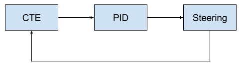
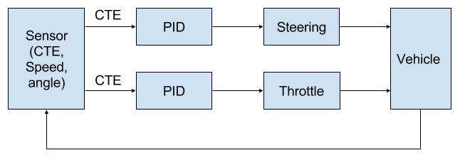
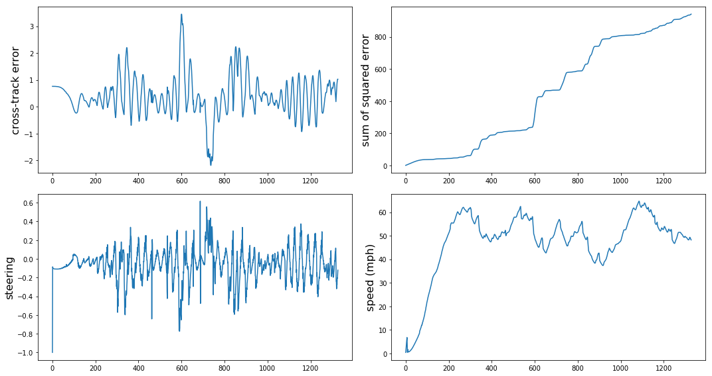

# PID Control
[](http://www.udacity.com/drive)

Jun Zhu


---

## Dependencies

#### [uWebSockets](https://github.com/uNetworking/uWebSockets) == 0.13
```
sudo apt-get install libssl-dev openssl libuv1-dev zlib1g-dev

git clone https://github.com/uWebSockets/uWebSockets

cd uWebSockets

mkdir build
cd build
cmake ..
make 
sudo make install

sudo ln -s /usr/lib64/libuWS.so /usr/lib/libuWS.so
```

## Single PID controller

A basic PID controller is implemented. The throttle is constant (0.3).


Tuning of the PID controller can be divided into three steps:

1. Set 'i' term and 'd' term to 0 and increase the 'p' term until the car starts to oscillate. Since there are many turns on the road, it is impossible to find a steady state. The car will soon lose control.
2. Since it is difficult to define the steady state error, the second step is to increase the 'd' term until the car can finish a lap without strong oscillation.
3. In the last step, 'i' term can be added. In principle, however, the car can run steadily without the 'i' term in the simulator.

The manually tuned coefficients are Kp=0.20, Ki=0.20, Kd=4.0 with an integration time of 100 and derivative time step of 1. The evolutions of different parameters are shown below. However, this only works when the throttle is around 0.3 (speed in the stead state is around 30 mph). As the throttle/speed increases, the car will quickly lose control.


## Two PID controllers

A throttle PID controller is added and the flow chart is shown below.



It was found that the "twiddle" algorithm does not work well because of two reasons:
[1] The result is random for one-lap run (partially because of the random initial position of the car).
[2] There are so many local minimums (working points).

Therefore, the controller was again optimized by hand. As a general rule, if the car cannot make a sharp turn, increase Ki. If it oscillates, reduce Kp and Ki. If it is too slow to change or a positive feedback is found during the oscillation (throwing the car out of the road), then increase Kd. In addition, the integration time was reduced to 50 and the derivative time step was increased to 2.

 
 
 Click to play the video:
 
 [](http://www.youtube.com/watch?v=KJeDqcyYKVk)
 
## Reference

- N. Melder and S. Tomlinson, "Game AI Pro" - Chapter 40.
- [Twiddle algorithm](https://www.youtube.com/watch?v=2uQ2BSzDvXs) by S. Thrun
- [Self-tuning PID controller for autonomous car tracking in urban traffic](http://ieeexplore.ieee.org/document/6688929/)
- https://robotics.stackexchange.com/questions/167/what-are-good-strategies-for-tuning-pid-loops
- [An introduction and tutorial for PID controllers by George Gillard](http://smithcsrobot.weebly.com/uploads/6/0/9/5/60954939/pid_control_document.pdf)
