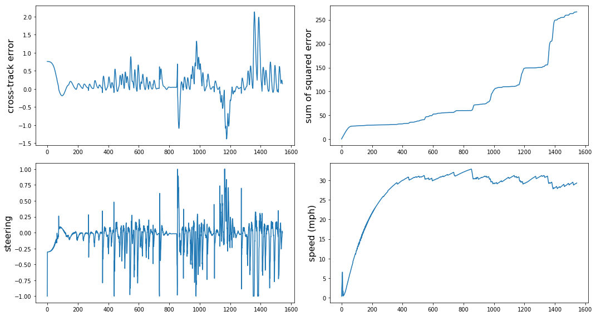
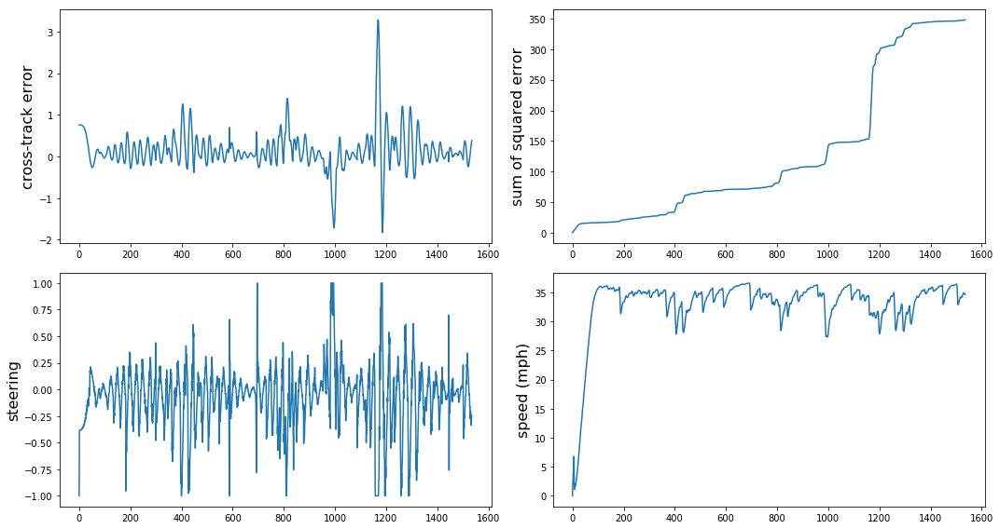

# CarND-Controls-PID
[](http://www.udacity.com/drive)

Jun Zhu

![alt

---

## Dependencies

```
sudo apt-get install libssl-dev openssl libuv1-dev zlib1g-dev

git clone https://github.com/uWebSockets/uWebSockets

cd uWebSockets

mkdir build
cd build
cmake ..
make 
sudo make install

sudo ln -s /usr/lib64/libuWS.so /usr/lib/libuWS.so
```

## Basic Build Instructions

1. Make a build directory: `mkdir build && cd build`
2. Compile: `cmake .. && make`
3. Run it: `./pid`. 

## Tune

Tuning of the PID controller can be divided into three steps:

1. Set 'i' term and 'd' term to 0 and increase the 'p' term until the car starts to oscillate. Since there are many turns on the road, it is impossible to find a steady state. The car will soon lose control.
2. Since it is difficult to define the steady state error, the second step is to increase the 'd' term until the car can finish a lap without strong oscillation.
3. In the last step, a small 'i' term can be added. In principle, however, the car can run steadily without the 'i' term in the simulator.

The manually tuned coefficients are Kp=0.20, Ki=0.20, Kd=4.0 with an integration time of 100 and derivative time step of 1. The evolutions of different parameters are shown below. However, this only works when the throttle is around 0.3 (speed in the stead state is around 30 mph). As the throttle/speed increases, the car will quickly lose control.



## Optimization with twiddle

 
 
 [](http://www.youtube.com/watch?v=bJhQG3MFG8c)

## Reference

[1] N. Melder and S. Tomlinson, "Game AI Pro" - Chapter 40.

