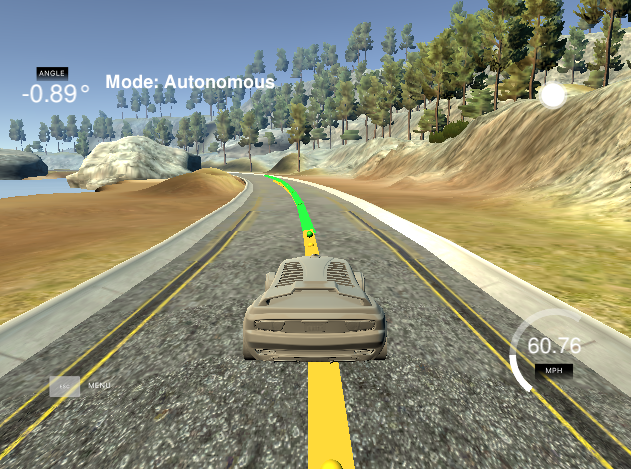
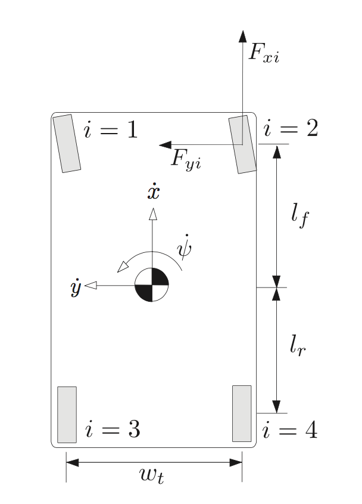
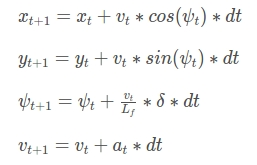

# Model Predictive Control
[](http://www.udacity.com/drive)
[](https://travis-ci.org/zhujun98/control)

Jun Zhu



---

## Dependencies

#### [uWebSockets](https://github.com/uNetworking/uWebSockets) == 0.13

```shell script
# install dependencies for uWebSockets
$ sudo apt-get install libssl-dev libuv1-dev
$ sudo apt-get install zlib1g-dev # may not be required
```

#### [Ipopt](https://projects.coin-or.org/Ipopt) and [CppAD](https://www.coin-or.org/CppAD/)
  
Follow the [instruction](https://github.com/udacity/CarND-MPC-Project/blob/master/install_Ipopt_CppAD.md).

#### [Eigen](http://eigen.tuxfamily.org/index.php?title=Main_Page) = 3.3.3

#### [Simulator](https://github.com/udacity/CarND-MPC-Project/releases)


## Vehicle model

A kinematic model (ignoring tire forces, gravity and mass)  is used to describe the vehicle in the simulator. The units used in this simulator is not self-consistent. For simplicity, let's say the speed is in MPH and the time is in second.

vehicle state is described by (`x`, `y`, `psi`, `v`), where `x`, `y` are the x, y coordinates respectively, `psi` is the orientation with respect to the x axis and `v` is the velocity.

vehicle actuator is described by (`delta`, `a`), where `delta` is the steering angle and `a` is the acceleration/deceleration.

`L_f` determines the turning rate of the vehicle. The larger the value, the smaller the turning rate! In this project, `L_f = 2.67`.

  |  
 

## Prediction
First, the prediction time step should be longer enough to make the system be able to response timely. In the meanwhile, a smaller time step is desired for a higher speed. However, it is found that the fit tends to become mad when making a sharp turn with a smaller time step.

Second, it does not help too much to predict the system evolution in a very long period, which is computationally expensive. But the car will lose control quickly if the total prediction period is too short.

As a compromise, 0.2 s time step and a total period of 1.6 s is being using.

## Latency
The latency can be compensated by tracking the vehicle at the time of measurement to the current time.

## Output

__Run with 100 ms latency__

 [](https://youtu.be/jSb7Ez4U58k)

__Run without latency (maximum speed = 110 MPH)__

This is for fun!!! The steering is fitted exponentially. Only 3 variables need to be optimized.

 [](https://youtu.be/RgOTkCFyyvU)

 
## References

* [Tyre Modelling for Use in Vehicle Dynamics Studies](10.4271/870421)
* [Kinematic and dynamic vehicle models for autonomous driving control design](http://ieeexplore.ieee.org/document/7225830/)
